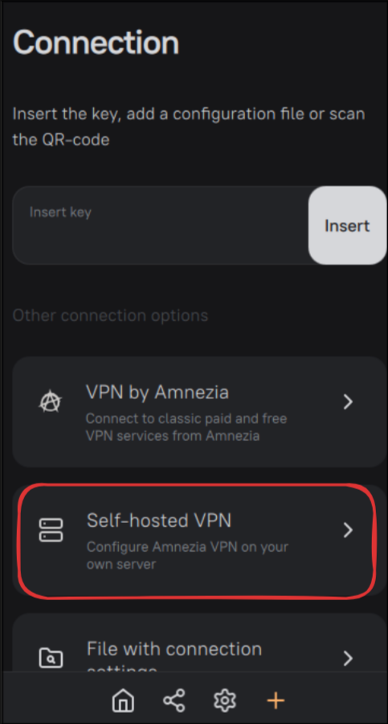
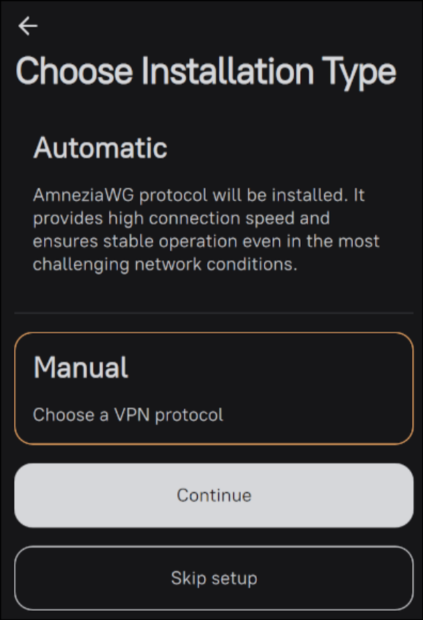
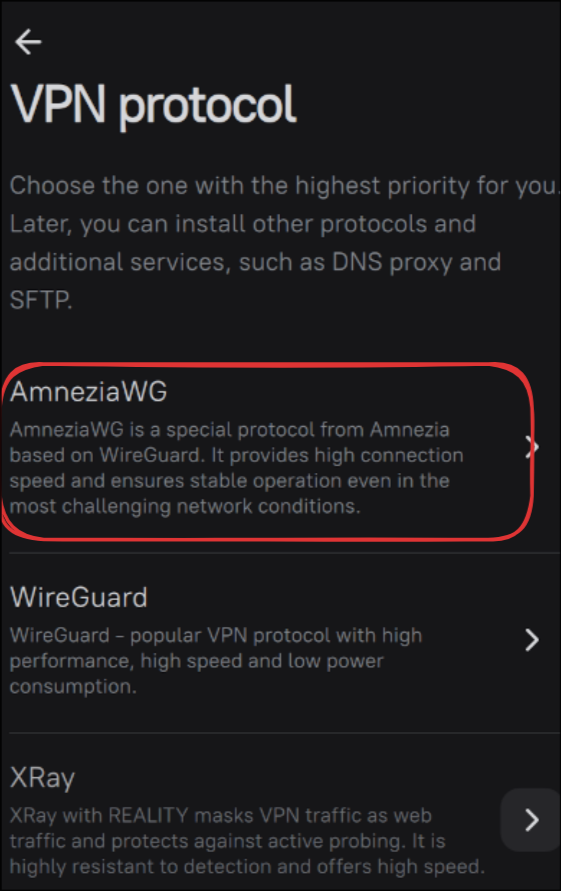

# Amnezia API

API на базе FastAPI для взаимодействия с сервисами амнезии.

> [!IMPORTANT]
> Данное API не предоставляет интерфейс для **развертывания и настройки** самих сервисов Амнезии на сервере. Эти этапы внедрения должны быть реализованы самостоятельно пользователем-администратором перед запуском текущего проекта. (см. подробнее в Инструкции по запуску)

---

## Этапы внедрения

- [1. Развертывание сервисов Амнезии](#1-развертывание-сервисов-амнезии)
    - [1.1 Установка актуального клиента Амнезии](#11-установка-актуального-клиента-амнезии)
    - [1.2 Настройка self-hosted сервера под выбранный протокол](#12-настройка-self-hosted-сервера-под-выбранный-протокол)
- [2. Настройка окружения Amnezia API](#2-настройка-окружения-amnezia-api)
- [3. Запуск проекта ](#3-запуск-проекта)

## 1. Развертывание сервисов Амнезии
### 1.1 Установка актуального клиента Амнезии

> [!NOTE]
> Этот этап выполняется на устройстве пользователя-администратора (не на сервере!)

Для подключения к VPS и настройке протокола необходимо установить клиент Amnezia на ваше устройство (следите, чтобы приложение было up to date):

- **Android**: [AmneziaVPN в Google Play](https://play.google.com/store/apps/details?id=org.amnezia.vpn)
- **iOS (iPhone/iPad)**: [AmneziaWG в App Store](https://apps.apple.com/ru/app/amneziawg/id6478928530)
- **Windows**: [Скачать .exe с официального сайта](https://amnezia.org/ru/downloads) или с [GitHub Releases](https://github.com/amnezia-vpn/amnezia-client/releases)
- **Linux**:
  ```bash
  yay -S amneziavpn # Arch Linux (AUR)
  # Или скачайте .deb со страницы релизов GitHub для Debian/Ubuntu
  ```

### 1.2 Настройка self-hosted сервера под выбранный протокол

После установки клиента выполните следующие шаги для настройки сервера:

1. Откройте приложение Amnezia и нажмите кнопку **Добавить** (крайняя правая кнопка в нижнем меню).
2. Выберите пункт **"Self-hosted VPN"**.

*Рисунок 1: настройка self-hosted VPN*
3. Введите учетные данные вашего сервера: **IP-адрес**, **Логин** и **Пароль**.
4. Нажмите кнопку **Continue**.
5. На странице выбора режима установки нажмите **Manual**.

*Рисунок 2: Выбор installation type*
6. Из списка протоколов выберите **AmneziaWG**.

*Рисунок 3: Выбор протокола*
7. Произведите настройку протокола, следуя инструкциям на экране.

## 2. Настройка окружения Amnezia API

## 3. Запуск проекта
